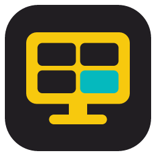
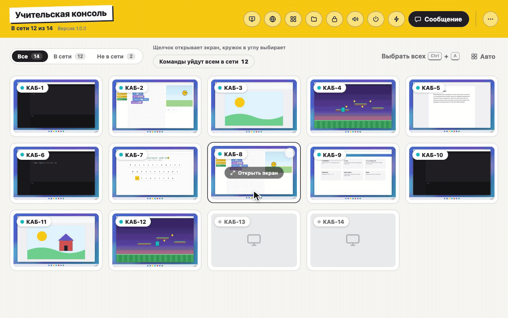
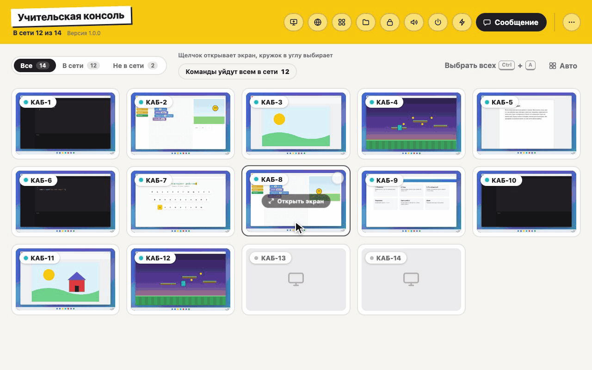

# Kiberclass

**Компьютерный класс в одном окне**

Учитель видит экраны всех учеников, показывает свой, блокирует компьютеры,
раздаёт материалы и собирает работы. Всё работает внутри сети класса:
без интернета, без сервера и без настройки.

&nbsp;

  

<picture>
  <source media="(prefers-color-scheme: dark)" srcset="media/class-dark.gif" />
  
</picture>

## Весь класс на одном экране

Плитка на каждый компьютер, а на ней живой экран ученика. Сразу видно, кто
пишет код, кто рисует, а кто ушёл в игру. Щелчок открывает экран крупно, и
оттуда можно взять мышь и клавиатуру ученика, чтобы помочь с задачей.
Плитки расставляются перетаскиванием, как стоят парты в классе.

## Показ своего экрана

<picture>
  <source media="(prefers-color-scheme: dark)" srcset="media/broadcast-dark.gif" />
  
</picture>

Экран учителя уходит всему классу или выбранным ученикам. В режиме
«Демонстрация» он встаёт на весь экран, как проектор, и мышь с клавиатурой
ученика не действуют. В режиме «В окне» ученик может повторять за учителем в
своих программах.

## Внимание на учителя

<picture>
  <source media="(prefers-color-scheme: dark)" srcset="media/lock-dark.gif" />
  
</picture>

Одна кнопка закрывает экраны учеников и выключает мышь с клавиатурой. На экране
остаётся ваш текст: «Смотрим на доску», «Слушаем задание». Блокировка
переживает перезагрузку, а снимается той же кнопкой.

## Сайты и программы у всех сразу

<picture>
  <source media="(prefers-color-scheme: dark)" srcset="media/sites-dark.gif" />
  
</picture>

Нужный сайт открывается на всех компьютерах за один щелчок, без диктовки адреса.
Программы берутся прямо из меню «Пуск» учеников: консоль покажет, где
программа есть, а где её не хватает, и умеет закрыть лишнее.

## Работы сами приходят к учителю

<picture>
  <source media="(prefers-color-scheme: dark)" srcset="media/files-dark.gif" />
  
</picture>

Попросите сдать работу, и у каждого ученика откроется окно: он перетащит туда
свой файл. Работы лягут в папку урока на компьютере учителя, у каждого ученика
своя. Материалы к уроку раздаются так же просто: перетащите файлы на консоль.

## Новый компьютер за минуту

<picture>
  <source media="(prefers-color-scheme: dark)" srcset="media/pairing-dark.gif" />
  
</picture>

Консоль показывает шестизначный код, ученик вводит его в своей программе, и
компьютер появляется в классе. Одним кодом подключается весь класс, а чужой
компьютер без кода к консоли не подключится.

## И ещё

- **Сообщения.** Текст на весь экран ученика: «Сохраните работу, через 5 минут перемена».
- **Питание.** Выключить, перезагрузить или завершить сеанс, включить компьютеры по сети.
- **Звук и яркость.** Выключить звук у класса, выставить громкость и яркость ползунком.
- **Быстрая панель.** Круг с частыми командами поверх всех окон, когда консоль свёрнута.
- **Обновления.** Консоль обновляется сама и обновляет учеников по сети класса.

## Установка

Нужны компьютеры с Windows 10 или 11 x64 в одной локальной сети.

1. Скачайте установщики со страницы [последнего выпуска](https://github.com/kiberclass/releases/releases/latest).
2. На компьютер учителя поставьте **Kiberclass-Teacher-Setup**.
3. На каждый компьютер ученика поставьте **Kiberclass-Student-Setup**. Программа
   работает службой Windows, поэтому ученик не может её закрыть.
4. В консоли нажмите «Добавить компьютеры» и введите код на компьютерах учеников.

Установщики пока не подписаны сертификатом Microsoft, и при первом запуске
Windows SmartScreen покажет предупреждение. Нажмите «Подробнее», затем
«Выполнить в любом случае».

## Обновления и безопасность

Ставить программы нужно один раз. Консоль сама находит новые версии здесь, а
компьютеры учеников обновляет по сети класса, интернет им для этого не нужен.
Каждое обновление подписано, и чужую сборку программы не примут.

Консоль и ученики общаются только внутри локальной сети по зашифрованному
каналу. Ключ ученика хранится в защищённой папке службы, куда у обычных
пользователей нет доступа.

 

Исходный код закрыт, здесь только готовые сборки.

