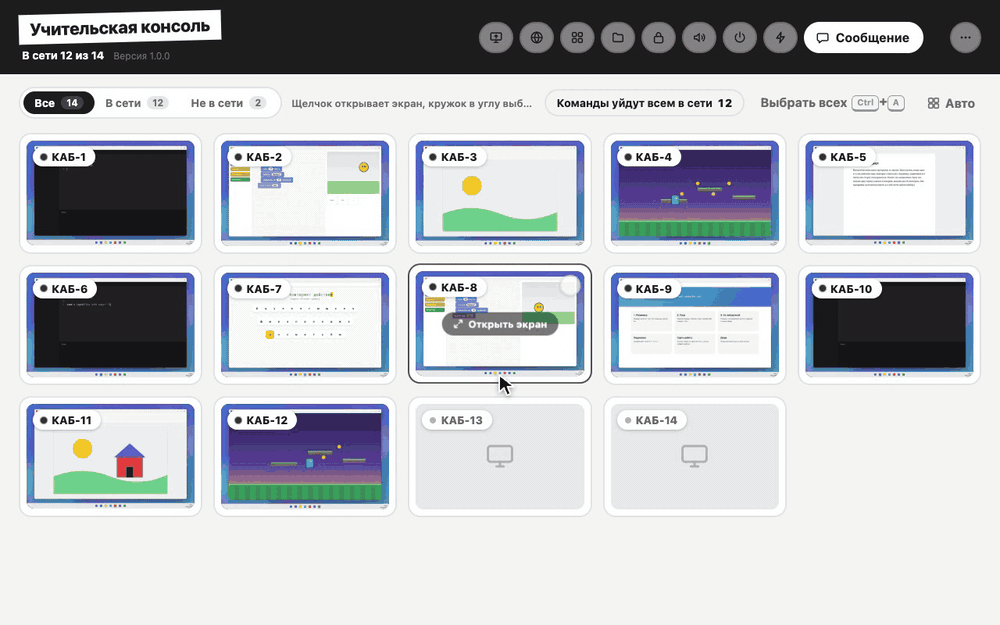
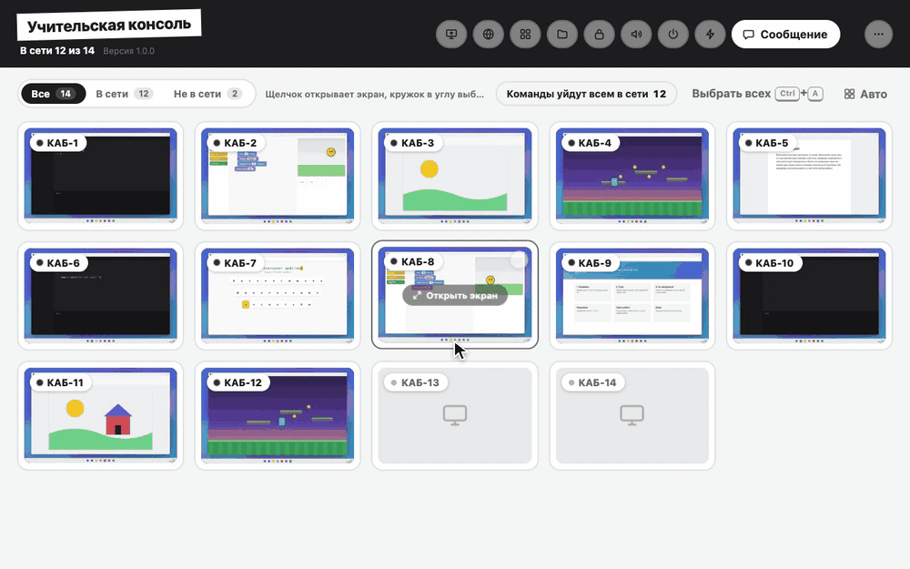
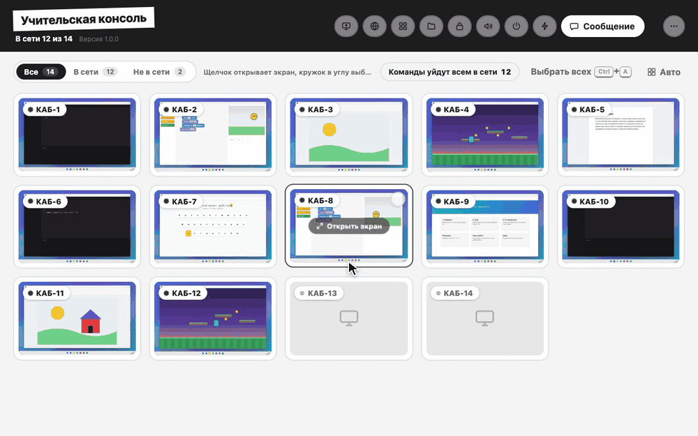
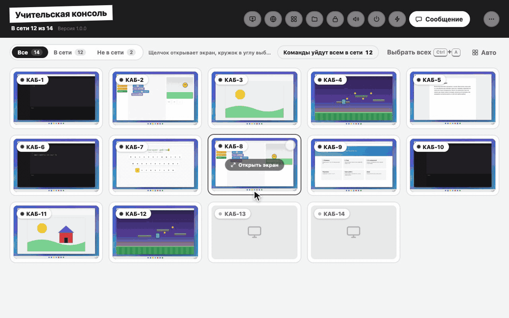

# Kiberclass

**Управление компьютерным классом из одного окна**

Учитель видит экраны всех учеников, показывает свой, блокирует компьютеры,
раздаёт материалы и собирает работы. Работает внутри сети класса: без интернета,
без сервера, без регистрации.

&nbsp;

[Что умеет](#что-умеет) · [Установка](#установка) · [Безопасность](#безопасность-и-данные) · [Вопросы](#вопросы-и-помощь)

<picture>
<source media="(prefers-color-scheme: dark)" srcset="assets/class-dark.gif">

</picture>

## Для кого

Для школ, кружков и школ программирования, где урок идёт за компьютерами:
информатика, программирование, робототехника, дизайн. Учитель тратит время на
урок, а не на то, чтобы ходить между партами, диктовать адреса сайтов и собирать
файлы с флешек.

Нужен один компьютер учителя и компьютеры учеников с Windows 10 или 11 (x64) в
одной локальной сети. Сервер, облако и учётные записи не нужны.

## Что умеет

**Весь класс на одном экране.** Плитка на каждый компьютер с живым экраном
ученика. Сразу видно, кто пишет код, кто рисует, а кто ушёл в игру. Щелчок
открывает экран крупно, и оттуда можно взять мышь и клавиатуру ученика, чтобы
помочь с задачей. Плитки расставляются перетаскиванием, как стоят парты.

**Показ своего экрана.** Экран учителя уходит всему классу или выбранным
ученикам. В режиме «Демонстрация» он встаёт на весь экран, как проектор. В режиме
«В окне» ученик повторяет за учителем в своих программах.

<picture>
<source media="(prefers-color-scheme: dark)" srcset="assets/broadcast-dark.gif">

</picture>

**Внимание на учителя.** Одна кнопка закрывает экраны учеников и выключает мышь с
клавиатурой. На экране остаётся ваш текст: «Смотрим на доску», «Слушаем
задание». Блокировка переживает перезагрузку и снимается той же кнопкой.

<picture>
<source media="(prefers-color-scheme: dark)" srcset="assets/lock-dark.gif">

</picture>

**Сайты и программы у всех сразу.** Нужный сайт открывается на всех компьютерах за
один щелчок. Программы берутся из меню «Пуск» учеников: консоль покажет, где
программа есть, а где её не хватает, и умеет закрыть лишнее.

<picture>
<source media="(prefers-color-scheme: dark)" srcset="assets/sites-dark.gif">

</picture>

**Работы приходят к учителю сами.** Попросите сдать работу, и у каждого ученика
откроется окно, куда он перетащит файл. Работы лягут в папку урока на компьютере
учителя, у каждого ученика своя. Материалы к уроку раздаются так же: перетащите
файлы на консоль.

<picture>
<source media="(prefers-color-scheme: dark)" srcset="assets/files-dark.gif">

</picture>

**Новый компьютер за минуту.** Консоль показывает шестизначный код, ученик
вводит его у себя, и компьютер появляется в классе. Одним кодом подключается
весь класс.

Ещё:

- **Сообщения.** Текст на весь экран ученика: «Сохраните работу, через 5 минут перемена».
- **Питание.** Выключить, перезагрузить, завершить сеанс, включить компьютеры по сети.
- **Звук и яркость.** Выключить звук у класса, выставить громкость и яркость.
- **Быстрая панель.** Круг с частыми командами поверх окон, когда консоль свёрнута.

## Установка

1. Откройте [последний выпуск](https://github.com/kiberclass/releases/releases/latest)
   и скачайте оба установщика.
2. На компьютер учителя поставьте **Kiberclass-Teacher-Setup**.
3. На каждый компьютер ученика поставьте **Kiberclass-Student-Setup** от имени
   администратора. Программа работает службой Windows, поэтому ученик не может её
   закрыть.
4. В консоли нажмите «Добавить компьютеры» и введите показанный код на
   компьютерах учеников.

Программы ставятся один раз. Дальше консоль сама находит новые версии и по сети
класса обновляет учеников, интернет им для этого не нужен.

<b>Windows пишет «Система Windows защитила ваш компьютер»</b>

 

Установщики пока не подписаны сертификатом Microsoft, поэтому при первом запуске
SmartScreen показывает предупреждение. Нажмите «Подробнее», затем «Выполнить в
любом случае». Убедитесь, что файл скачан именно со страницы выпуска выше.

Если антивирус блокирует установщик, приостановите его защиту только на время
установки и включите обратно сразу после. Не оставляйте защиту выключенной и не
добавляйте папку программы в постоянные исключения.

<b>Как проверить на одном компьютере, прежде чем ставить в класс</b>

 

Поставьте консоль на компьютер учителя и ученика на один-два компьютера, добавьте
их кодом и пройдите урок: показ экрана, блокировка, сдача работы. Удаление
через «Приложения» Windows убирает программу, службу и данные ученика полностью.

## Безопасность и данные

Ученический компьютер получает права на управление, поэтому вот что важно знать.

- **Всё внутри сети класса.** Консоль и ученики общаются только друг с другом по
  зашифрованному каналу. Экраны, файлы и сообщения не уходят в интернет и не
  проходят через наши серверы, у нас их нет.
- **Единственный выход в интернет.** Консоль учителя раз в несколько часов
  спрашивает на этой странице, вышла ли новая версия. Больше никуда. Учётных
  записей, статистики и рекламы нет.
- **Чужой компьютер не подключится.** Подключение только по коду с консоли, код
  живёт 5 минут, число неверных попыток ограничено. Подобрать его, перехватив
  трафик, нельзя.
- **Ключ ученика не достать.** Он лежит в защищённой папке службы, куда у обычных
  пользователей нет доступа. Окно ученика ключа не видит.
- **Обновления подписаны.** Консоль и ученики принимают только сборки с подписью
  Kiberclass, чужую программу они не поставят.
- **Данные остаются у вас.** Работы учеников лежат в папке урока на компьютере
  учителя, список компьютеров и настройки на нём же.

Исходный код закрыт, здесь публикуются только готовые сборки. Поэтому мы стараемся
делать проверяемым то, что можно проверить: сетевой трафик можно посмотреть
любым анализатором, а программу удалить целиком в любой момент.

## Вопросы и помощь

Что-то не установилось, не работает в вашей сети или не хватает возможности,
напишите автору напрямую:

- Telegram: [@aidamirkambiev](https://t.me/aidamirkambiev)
- Почта: [dev.aidamir@gmail.com](mailto:dev.aidamir@gmail.com)

Опишите версию Windows и что именно произошло, так быстрее разберёмся. Можно и
через [обращения на GitHub](https://github.com/kiberclass/releases/issues).

 

Kiberclass для Windows 10 и 11 x64.

